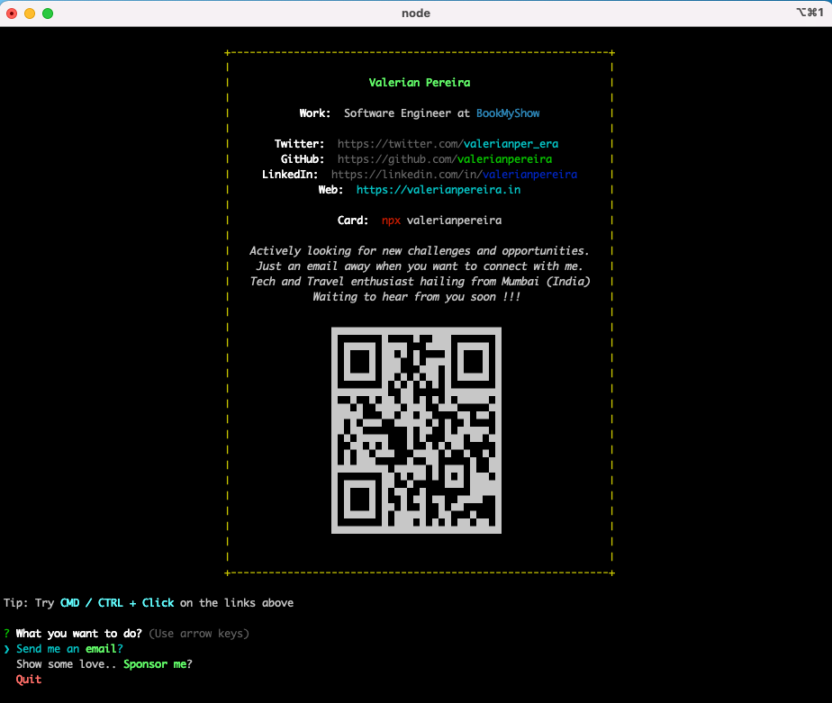

# npx valerianpereira

[](https://www.npmjs.com/package/valerianpereira)
[](https://www.npmjs.com/package/valerianpereira)

My business card, printed straight into your terminal. Built with Node.js.

```
npx valerianpereira
```

No install needed — `npx` fetches and runs it.



## What you get

- Who I am and where I work, with clickable links (`CMD` / `CTRL` + click)
- A QR code for [valerianpereira.in](https://valerianpereira.in)
- A menu to email me, open my site, browse my open source, or sponsor me

## About me

**Valerian Pereira** — Head of Data Team at [BookMyShow](https://bookmyshow.com),
based in Mumbai, India. I own the data function end to end: the data platform
(Databricks, AWS, ingestion and warehousing), analytics and the reporting and
reconciliation systems the business runs on, and data science. Fifteen years
building data platforms, APIs and the infrastructure underneath them.

- Web: [valerianpereira.in](https://valerianpereira.in) — a SQL console you can query, plus a CV
- GitHub: [@valerianpereira](https://github.com/valerianpereira)
- LinkedIn: [valerianpereira](https://www.linkedin.com/in/valerianpereira/)
- X: [@valerianper_era](https://x.com/valerianper_era)

## Other things I've built

- [backup-action](https://github.com/valerianpereira/backup-action) — GitHub Action that backs up MySQL, MongoDB and PostgreSQL databases and directories over SSH
- [fifa-wc26](https://github.com/valerianpereira/fifa-wc26) — World Cup 2026 in the terminal: fixtures, live scores, standings, ASCII bracket
- [who-is](https://github.com/valerianpereira/who-is) — Alexa skill for domain WHOIS, expiry and hosting details
- [alexa-rail-info](https://github.com/valerianpereira/alexa-rail-info) — Alexa skill for Indian Railways: cancellations, reschedules, PNR status
- [webuzo-docker-centos](https://github.com/valerianpereira/webuzo-docker-centos) — the Webuzo hosting control panel in a single container

## Run it locally

```
git clone https://github.com/valerianpereira/npx_valerianpereira.git
cd npx_valerianpereira
npm install
node cli.js
```

Card content lives in [`lib/data.js`](lib/data.js); the menu lives in [`cli.js`](cli.js).

## Reference

Thanks to the [amazing article](https://studioelsa.se/blog/open-source-oss-npx-business-card)
from @jackboberg and implementation from @anmol098.

## License

ISC — see [LICENSE](LICENSE).
