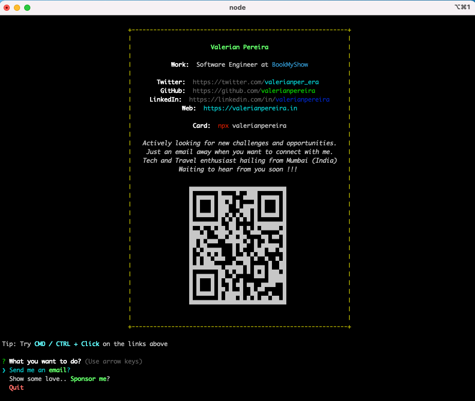

# Business Card - CLI | valerianpereira
Business card CLI utility - built with NodeJS

Access the card from the CLI using the following command:
```
npx valerianpereira
```

# Result


# Reference
Thanks to the [amazing article](https://studioelsa.se/blog/open-source-oss-npx-business-card) from @jackboberg and implementation from @anmol098

# Published on NPM
Published on NPM with the following name
[valerianpereira](https://www.npmjs.com/package/valerianpereira)
